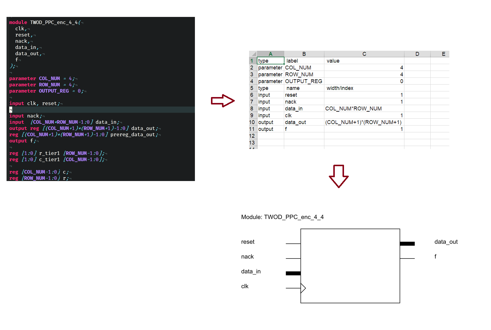

# HDL_Visualization_Tool

This tool reads a HDL file then export:

1. a table of parameter, input and output with value and width
2. svg file of i/o
3. exporting PDF from svg (need svglib)

Note: current version only supports Verilog 2004


# Install

1. Python
2. svglib of Python:  

```
pip install svglib
```

Download from this link:
```
https://github.com/khanhdang/HDL_Visualization_Tool/releases
```

# Run
Note: in Windows OS

```
python.exe .\py\extract_io.py .\example\ex1.v
```
export PDF
```
python .\py\pdfexporter.py .\<module name>.svg figure.pdf
```

# example
The example of verilog code and pdf file is included in folder example



# Contact

Khanh N. Dang 

```
khanh.n.dang@ieee.org
```
